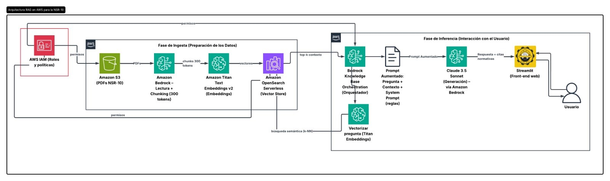

# Asistente Experto NSR-10 — Sistema RAG con AWS Bedrock

Chatbot inteligente que responde preguntas sobre el **Reglamento Colombiano de Construccion Sismo Resistente (NSR-10)** utilizando un sistema de **Retrieval-Augmented Generation (RAG)** con servicios de AWS y una interfaz web con Streamlit.



---

## Como funciona el RAG

**RAG (Retrieval-Augmented Generation)** es una tecnica que combina busqueda de documentos con generacion de texto por IA. En lugar de que el modelo "invente" respuestas, primero busca la informacion relevante en tus documentos y luego genera una respuesta fundamentada.

### Fase 1 — Ingesta de datos (preparacion)

Esta fase ocurre **una sola vez** al configurar la Knowledge Base en AWS:

1. **Carga de PDFs** — Los documentos de la NSR-10 se suben a un bucket de **Amazon S3**. Puedes usar el script `upload_s3.py` para subirlos directamente desde tu terminal (ver seccion mas abajo).
2. **Lectura y chunking** — **Amazon Bedrock** lee los PDFs y los divide en fragmentos de ~300 tokens.
3. **Generacion de embeddings** — **Amazon Titan Text Embeddings v2** convierte cada fragmento en un vector numerico que representa su significado semantico.
4. **Almacenamiento vectorial** — Los vectores se almacenan en **Amazon OpenSearch Serverless**, que actua como base de datos vectorial.

### Fase 2 — Inferencia (interaccion con el usuario)

Esta fase ocurre **cada vez que el usuario hace una pregunta**:

1. **Vectorizacion de la pregunta** — La pregunta del usuario se convierte en un vector usando **Titan Embeddings**.
2. **Busqueda semantica (k-NN)** — Se buscan los 5 fragmentos mas similares en OpenSearch.
3. **Prompt aumentado** — Se construye un prompt que incluye: la pregunta + los fragmentos encontrados + reglas del system prompt.
4. **Generacion** — **Claude 3.5 Sonnet** (via Amazon Bedrock) genera una respuesta fundamentada en los documentos.
5. **Respuesta al usuario** — La respuesta + las citas normativas se muestran en la interfaz de **Streamlit**.

---

## Requisitos previos en AWS

Antes de ejecutar la aplicacion, debes tener configurados los siguientes servicios en tu cuenta de AWS:

### 1. IAM — Roles y permisos

Crea un usuario o rol de IAM con las siguientes politicas:

- `AmazonBedrockFullAccess` (o permisos especificos para `bedrock-agent-runtime`)
- `AmazonS3FullAccess` (acceso al bucket con los PDFs — necesario para subir y leer archivos)
- `AmazonOpenSearchServiceFullAccess` (si usas OpenSearch gestionado)

> **Nota:** Si ejecutas la app desde tu computadora local, configura las credenciales AWS con:
> ```bash
> aws configure
> ```
> Esto guardara tu `AWS_ACCESS_KEY_ID` y `AWS_SECRET_ACCESS_KEY` en `~/.aws/credentials`.

### 2. Amazon S3 — Bucket con documentos

1. Crea un bucket S3 en la region que vayas a usar (ej: `us-east-1`).
2. Sube los archivos PDF de la NSR-10 al bucket. Puedes hacerlo de dos formas:
   - **Opcion A (recomendada):** Usa el script `upload_s3.py` incluido en este repositorio (ver seccion "Subir documentos a S3").
   - **Opcion B:** Sube los archivos manualmente desde la consola de AWS.

### 3. Amazon Bedrock — Habilitar modelos

1. Ve a **AWS Console > Amazon Bedrock > Model access**.
2. Solicita acceso a:
   - **Amazon Titan Text Embeddings v2** (para generar embeddings)
   - **Anthropic Claude 3.5 Sonnet** (para generar respuestas) — o el modelo que prefieras.

### 4. Amazon Bedrock — Knowledge Base

1. Ve a **Bedrock > Knowledge bases > Create knowledge base**.
2. Configura:
   - **Data source:** El bucket S3 donde subiste los PDFs.
   - **Embeddings model:** Amazon Titan Text Embeddings v2.
   - **Vector store:** Amazon OpenSearch Serverless (se crea automaticamente o puedes usar uno existente).
   - **Chunking strategy:** Fixed size, ~300 tokens (recomendado).
3. Sincroniza la Knowledge Base.
4. **Copia el Knowledge Base ID** — lo necesitaras para la configuracion.

### 5. Obtener el Model ARN

El ARN del modelo de generacion lo encuentras en:
**Bedrock > Foundation models > Tu modelo > Copiar ARN**

Ejemplo:
```
arn:aws:bedrock:us-east-1::foundation-model/anthropic.claude-3-5-sonnet-20241022-v2:0
```

---

## Instalacion y ejecucion local

### 1. Clonar el repositorio

```bash
git clone https://github.com/bryansycruz/AWS_NSR_RAG.git
cd aws-nsr
```

### 2. Crear entorno virtual

```bash
python -m venv venv

# Linux / Mac:
source venv/bin/activate

# Windows:
venv\Scripts\activate
```

### 3. Instalar dependencias

```bash
pip install -r requirements.txt
```

### 4. Configurar variables de entorno

Copia el archivo de ejemplo y completa tus valores:

```bash
# Linux / Mac:
cp .env.example .env

# Windows:
copy .env.example .env
```

Edita `.env` con tus datos:

```env
AWS_REGION=us-east-1
KB_ID=TU_KNOWLEDGE_BASE_ID
MODEL_ID=arn:aws:bedrock:us-east-1::foundation-model/anthropic.claude-3-5-sonnet-20241022-v2:0
S3_BUCKET_NAME=nombre-de-tu-bucket
```


### 5. Configurar credenciales AWS

Asegurate de tener tus credenciales de AWS configuradas:

```bash
aws configure
```

O exporta las variables directamente:

```bash
export AWS_ACCESS_KEY_ID=tu-access-key
export AWS_SECRET_ACCESS_KEY=tu-secret-key
```

### 6. Subir documentos a S3

Coloca tus archivos PDF de la NSR-10 dentro de la carpeta `s3/` del proyecto. Luego ejecuta:

```bash
python upload_s3.py
```

El script subira automaticamente todos los archivos PDF de la carpeta `s3/` a tu bucket de S3. Consulta el archivo `s3/LEEME.txt` para mas detalles.

### 7. Ejecutar la aplicacion

```bash
streamlit run app.py
```

La aplicacion se abrira en `http://localhost:8501`.

---

## Estructura del proyecto

```
aws-nsr/
├── app.py              # Aplicacion principal (Streamlit + Bedrock)
├── upload_s3.py        # Script para subir PDFs a S3 desde la terminal
├── s3/                 # Carpeta donde colocar los PDFs de la NSR-10
│   └── LEEME.txt       # Instrucciones sobre la carpeta s3
├── main.py             # Punto de entrada alternativo
├── .env.example        # Plantilla de variables de entorno
├── .env                # Variables de entorno reales (NO se sube a git)
├── .gitignore          # Archivos excluidos del repositorio
├── requirements.txt    # Dependencias de Python
├── pyproject.toml      # Metadatos del proyecto
├── bot.JPG             # Imagen del sidebar
├── Diagrama en blanco.png  # Diagrama de arquitectura AWS
└── README.md           # Este archivo
```

---

## Tecnologias utilizadas

| Servicio | Funcion |
|----------|---------|
| **Amazon S3** | Almacenamiento de documentos PDF de la NSR-10 |
| **Amazon Bedrock** | Orquestacion de la Knowledge Base y acceso a modelos |
| **Amazon Titan Embeddings v2** | Generacion de vectores semanticos de los documentos |
| **Amazon OpenSearch Serverless** | Almacenamiento y busqueda vectorial (k-NN) |
| **Claude 3.5 Sonnet** | Modelo de lenguaje para generacion de respuestas |
| **Streamlit** | Interfaz web del chatbot |
| **boto3** | SDK de AWS para Python |
